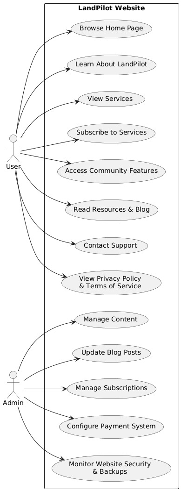

**ENGR 5510G- FOUNDATION OF SOFTWARE ENGINEERING**

**GROUP 10, ASSIGNMENT 1**

**GROUP MEMBERS:**

- **Ademoye Oluwadamifola Mark**

- **Nafis Bhamjee**

- **Hanbo Wang**

- **Mohammad Zaki Yasser**

***The current build of this project can be found [here][https://mohammadyasserzaki.github.io/Foundations-of-SE-group-10-Project/]***

**ASSIGNMENT:**

Use a freelancing website like upwork or freelancer. Find a task
required for a set amount of money (500 to 1000 USD). Pick a customer
that has a history of completed jobs. Pick a job that has sufficient
details that you do not need to contact the poster about the job.

Write between 2-4 pages document that includes: Functional requirements
analysis. Non-functional requirements analysis (if provided). Use case
diagrams.

**ANSWER:**

Below is the project found on the upwork platform at a fixed price of
\$600 USD:

Build a Full Professional Website for The LandPilot Using Elementor
(WordPress)

Job Description:  
We are looking for a skilled WordPress and Elementor expert to design
and develop a complete, professional, and user-friendly website for The
LandPilot. The website should reflect our brand identity and establish
our platform as the ultimate one-stop solution for land deal
facilitation and acceleration.  
Key Objectives:  
Create a visually appealing, fully responsive website.Optimize the
website for user experience (UX) and search engine visibility (SEO).  
Implement engaging content and seamless navigation to drive conversions
and user engagement.  
Scope of Work:  
1. Website Structure: The site will include the following pages: Home
Page: Hero section with headlines, CTAs, and an overview of the
platform.Key features and services summary. Testimonials and social
proof (highlight Robin Seib's expertise). About Us: Our mission and
vision. Robin Seib's background and expertise.  
Journey and milestones of The LandPilot. Services: Free Features
(community access, weekly calls). Subscription Tiers (\$99/month,
\$249/month). Premium Services (JV/assignment programs, marketing,
funding).  
Community Page: Benefits of joining the community (Facebook group,
shared resources, etc.). User testimonials and success stories.  
Resources/Blog: Categorized articles (Beginner Tips, Advanced
Strategies, Case Studies).Ability for admin to easily add and manage new
posts via WordPress.  
Contact Us: Contact form (for inquiries and support). Address, phone,
and email details. Embedded social media links. Privacy Policy & Terms
of Service: Include pages for legal compliance (content will be
provided).  
2. Design and Development: Modern, clean, and professional design
tailored to the land investment niche. Mobile-first, fully responsive
design for all screen sizes. Optimized for fast loading speeds and
SEO.  
3. Content Integration: Incorporate provided content into the design.
Assist with writing/editing where needed to ensure the tone aligns with
our branding.  
4. Functionality: Elementor Pro-based design (license will be provided
if necessary). Newsletter signup integration.  
Secure payment gateway setup for subscriptions.Blog and resource
management functionality.  
5. Technical Requirements: WordPress CMS using Elementor for easy future
updates. Basic on-page SEO setup (meta tags, alt text for images, etc.).
Security plugins and backups configured.  
Qualifications:Proven experience building full websites with WordPress
and Elementor. Strong design and UX skills. Knowledge of on-page SEO
best practices.Ability to deliver a fully functional, polished website
within \[insert timeline, e.g., 3-4 weeks\]. What We'll Provide:  
Branding guidelines (logo, color palette, etc.). Content for each page
(drafts for refinement).Access to Elementor Pro if required.  
Deliverables: Fully designed and developed website ready for launch.
Training or guide for basic website management.  
Ongoing support for 30 days post-launch (optional, if included in your
proposal).

**1. Introduction**

The purpose of this document is to analyse the requirements of the
project "Build a Full Professional Website for LandPilot". The goal is
to design and develop a complete, professional, and user-friendly
website that reflects the brand identity. This analysis includes
functional and non-functional requirements, as well as a UML diagram to
illustrate the interactivity of users with the system.

**2. Functional Requirements Analysis**

Below are the core functionalities of the website ,the expected
behaviour of the system and what it should do:

1\. Website Navigation: Users should be able to navigate through the
website using a clear and consistent menu structure and interact with
other modules.

2\. Home Page: Users should be able to view a hero section with
headlines, CTA(call-to-action)s, and an overview of the platform on the
Home Page.

3\. About Us: Users should be able to view the company\'s mission,
vision, background, members and expertise on the About Us page.

4\. Services: Users should be able to view free features, subscription
tiers, and premium services on the Services section.

5\. Community Page: Users should be able to view benefits, user
testimonials, and success stories on the Community Page.

6\. Resources: Admin Users should be able to view and add categorized
articles and easily search for specific topics on the Resources page.

7\. Content Management: Admin users should be able to easily add, edit,
and manage new posts via WordPress.

8\. Contact Us: Users should be able to submit inquiries and support
requests using a contact form on the Contact Us page.

9\. Newsletter Signup: Users should be able to sign up for a newsletter
using a clear and visible signup form.

10\. Secure Payment Gateway: Users should be able to securely subscribe
to services using a trusted payment gateway.

**3. Non-Functional Requirements Analysis**

Below are some non-functional requirements of the website depicting how
it should perform and its focus on attributes related to quality:

1\. Performance: The website should load within 5 seconds and be
optimized for search engines (SEO).

2\. Security: The website should have a secure payment gateway
integration, security plugins, and backups configured.

3\. Usability: The website should have a user-friendly interface, clear
navigation, and be optimized for mobile devices, tablets, and desktops.

4\. Scalability: The website should be able to handle increased traffic
and user engagement without compromising performance.

5\. Compatibility: The website should be compatible with major browsers
(Chrome, Firefox, Safari, Edge) and various devices and screen sizes.

6\. Accessibility: The website should comply with web accessibility
standards and have a clear and consistent navigation and content
structure.

7.Compliance and Legal Measures: The website should comply with data
protection regulations,legal standards and also display privacy policies
and terms of use.

**4. UML (Unified Modeling Language) Diagram:**

Below is a basic UML diagram of the LandPilot website and how a User and
Admin would interact with the system:

